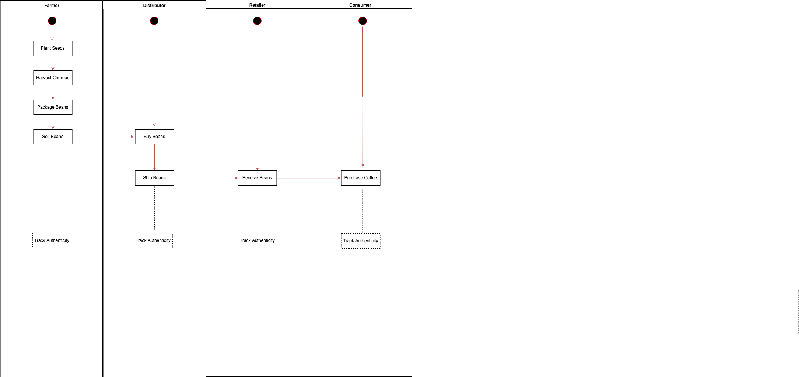
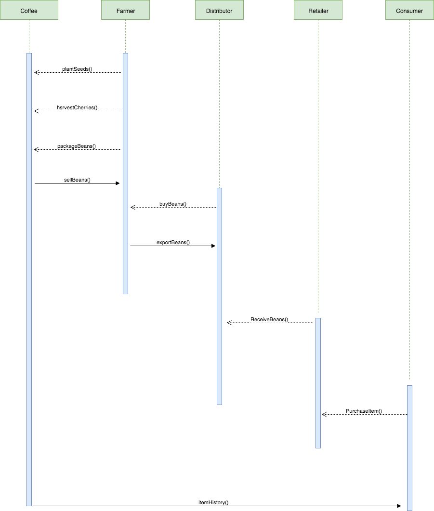
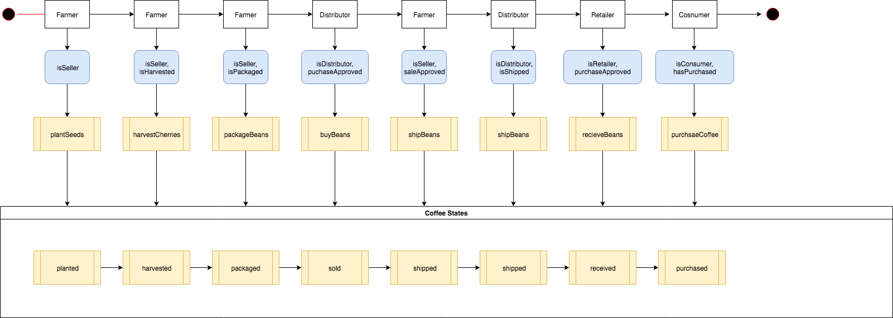
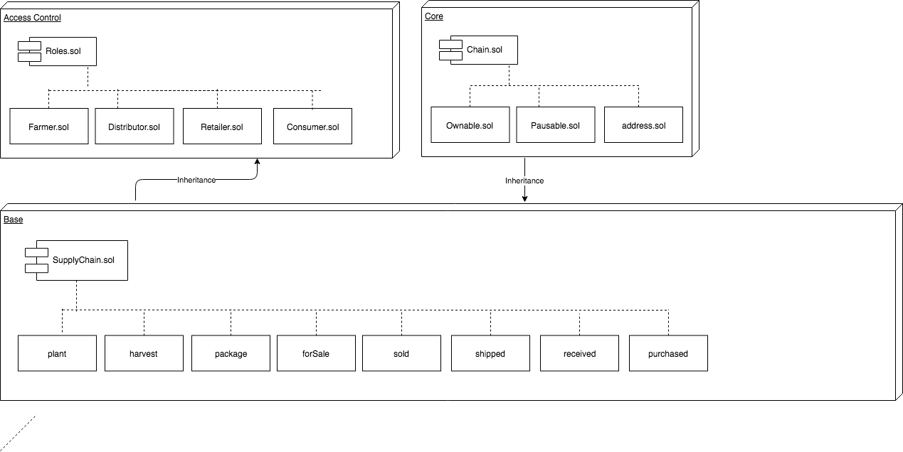

# Project6B
Architect a Blockchain Supply Chain Solution - Part B

Using:
- Truffle v4.1.15
- node v10.7.0
- Solidity v0.4.25
- Web3:1.0.0-beta.48

### Prerequisites

Install Node and NPM using the installer package available from the (Node.js® web site)[https://nodejs.org/en/].

- Installation
```
npm install
```
- To test the contract start ```ganache-cli``` and type ```truffle test```.
There are ten tests that should all pass.

```
Admins-MacBook-Pro-2:Project_6B admin$ truffle test
Using network 'development'.

ganache-cli accounts used here...
Contract Owner: accounts[0]  0xe554340f81be79687cb3b971a5740ee8de171e59
Farmer: accounts[1]  0x3cc77f53dbc6a4ed047728a724e8044b6f6cbdf7
distributor: accounts[2]  0x3eeb3bf5819f3fde044797e2bdcb4009ade43ba5
retailer: accounts[3]  0x56e5d862607521db6eef442a1b7e8f7f4f6404fc
Consumer: accounts[4]  0x0a72f8ae50fcfec97333aa814e128d23cfc05d75


  Contract: SupplyChain
Planted 0
    ✓ Testing smart contract function PlantItem() that allows a farmer to harvest coffee (693ms)
Harvested 1
    ✓ Testing smart contract function harvestItem() that allows a farmer to process coffee (263ms)
Packed 2
    ✓ Testing smart contract function packItem() that allows a farmer to pack coffee (216ms)
For Sale 3
    ✓ Testing smart contract function sellItem() that allows a farmer to sell coffee (223ms)
Buy Item 4
    ✓ Testing smart contract function buyItem() that allows a distributor to buy coffee (185ms)
Ship Item 5
    ✓ Testing smart contract function shipItem() that allows a distributor to ship coffee (183ms)
Receive Item 6
    ✓ Testing smart contract function receiveItem() that allows a retailer to mark coffee received (193ms)
Purchase Item 7
    ✓ Testing smart contract function purchaseItem() that allows a consumer to purchase coffee (396ms)
    ✓ Testing smart contract function fetchItemBufferOne() that allows anyone to fetch item details from blockchain (98ms)
    ✓ Testing smart contract function fetchItemBufferTwo() that allows anyone to fetch item details from blockchain


  10 passing (3s)

```
- Install Metamask plugin for chrome

- Ensure that your wallet contains enough Ether for transactions

- To start the application issue the command  ```npm run dev```.

## Contract deployment
```
truffle migrate --network rinkeby --reset --compile-all

Compiling ./contracts/Migrations.sol...
Compiling ./contracts/coffeeaccesscontrol/ConsumerRole.sol...
Compiling ./contracts/coffeeaccesscontrol/DistributorRole.sol...
Compiling ./contracts/coffeeaccesscontrol/FarmerRole.sol...
Compiling ./contracts/coffeeaccesscontrol/RetailerRole.sol...
Compiling ./contracts/coffeeaccesscontrol/Roles.sol...
Compiling ./contracts/coffeebase/SupplyChain.sol...
Compiling ./contracts/coffeecore/Ownable.sol...
Writing artifacts to ./build/contracts

Using network 'rinkeby'.

Running migration: 1_initial_migration.js
  Replacing Migrations...

  ... 0x6b3ec9ecbea875061b66f3fe9d186adf34b080fefc0f2ffca29c622f4827aaca
  Migrations: 0x8b45e9f3c2d6686c478c8fca8a21c9492d508496
Saving successful migration to network...
  ... 0x20ff3705a73567d82e284ad1339a3ef5dc66f52fc40838996ee292b7430b4a52
Saving artifacts...
Running migration: 2_deploy_contracts.js
  Replacing FarmerRole...
  ... 0xb047818943c5acdc5c6619156d5440d8a35ff8a35557319643980722d7b9ea98
  FarmerRole: 0x2e6cad4289217641d6aadb445d098feafd91bfcd
  Replacing DistributorRole...
  ... 0xb707b45fc83af132057468fba98b4659bbf88a227ba0b3a1d1d884947d0420c9
  DistributorRole: 0x3101ce997bcd40b4876fc5e089f4b002ac448952
  Replacing RetailerRole...
  ... 0x11a3f7bba4fddbfe80a864ec9d594311b01a5832e336526c333af471dfc712e4
  RetailerRole: 0x9e5d8d8c520dbaadfd3a8e084acd72492d5dc0dc
  Replacing ConsumerRole...
  ... 0xb612b69badd5a614627138565cdc8206da0daacccdcc34c995e504673ae36abc
  ConsumerRole: 0x9c5b5f808457a2f990a5dc3c3b6c85aecb6d0e9c
  Replacing SupplyChain...
  ... 0xac23c67388acb18eea4ba109ba8f88cec8f0b4543f9f0a6533be748fb66819e2
  SupplyChain: 0x069cab043eb796967ec732f44f7cd7c44178ceaa
Saving successful migration to network...
  ... 0x64abc555f4c0c90f85a98693447464d3ba5f9b90becd11b67362c1201749d00f
Saving artifacts...

```
## View details on Etherscan
### Contract address
https://rinkeby.etherscan.io/address/0x069cab043eb796967ec732f44f7cd7c44178ceaa

### Transaction information
```
TxHash:0xac23c67388acb18eea4ba109ba8f88cec8f0b4543f9f0a6533be748fb66819e2
TxReceipt Status:Success
```
https://rinkeby.etherscan.io/tx/0xac23c67388acb18eea4ba109ba8f88cec8f0b4543f9f0a6533be748fb66819e2


#### Plant transaction
```
TxHash:0xabc9a9e27eb76c521e737d7143b4d4b973ff90316c7f848cd252e790b2872b29
TxReceipt Status:Success
```
https://rinkeby.etherscan.io/tx/0xabc9a9e27eb76c521e737d7143b4d4b973ff90316c7f848cd252e790b2872b29

#### Harvest transaction
```
TxHash:0x911dfb32f9a8431bb168e0a6764ad76f1d18b17c4527d9bae332af11ae8746ca
TxReceipt Status:Success
```
https://rinkeby.etherscan.io/tx/0x911dfb32f9a8431bb168e0a6764ad76f1d18b17c4527d9bae332af11ae8746ca

#### Pack transaction
```
TxHash:0x9c2715835dfb5c2fd42869ac7bbba7b5d182e0b9a8c0c56c4d4635f61bf4c169
TxReceipt Status:Success
```
https://rinkeby.etherscan.io/tx/0x9c2715835dfb5c2fd42869ac7bbba7b5d182e0b9a8c0c56c4d4635f61bf4c169

#### ForSale transaction
```
TxHash:0x982b92dc2fa9d9c21f1efe4c0a1ef4fb4ce1609eead46e2b4e69c8ab882fa816
TxReceipt Status:Success
```
https://rinkeby.etherscan.io/tx/0x982b92dc2fa9d9c21f1efe4c0a1ef4fb4ce1609eead46e2b4e69c8ab882fa816

#### Buy transaction
```
TxHash:0x18362d381b873210fe3517cccd1b2d4dac3dfa38cf7a2a333c5091b7d720eb79
TxReceipt Status:Success
```
https://rinkeby.etherscan.io/tx/0x18362d381b873210fe3517cccd1b2d4dac3dfa38cf7a2a333c5091b7d720eb79

#### Ship transaction
```
TxHash:0x5057e43d46f4d40f3326401108282b7401794f7dcbfee316ab0e633997eaa049
TxReceipt Status:Success
```
https://rinkeby.etherscan.io/tx/0x5057e43d46f4d40f3326401108282b7401794f7dcbfee316ab0e633997eaa049

#### Received transaction
```
TxHash:0xb92a108c9790f591e1598be8a18133505ca7b620a6e639048a82d8f7bfdd9fdd
TxReceipt Status:Success
```
https://rinkeby.etherscan.io/tx/0xb92a108c9790f591e1598be8a18133505ca7b620a6e639048a82d8f7bfdd9fdd

#### Purchased transaction
```
TxHash:0x6108d9ae81d4235d35115318b3f13bacbfdf490774897daa04db1fdae32a56d4
TxReceipt Status:Success
```
https://rinkeby.etherscan.io/tx/0x6108d9ae81d4235d35115318b3f13bacbfdf490774897daa04db1fdae32a56d4


## UML Diagrams

### Activity Diagram


### Sequence Diagram


### State Diagram


### Data Diagram (Data model)

